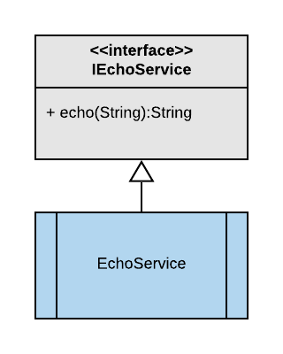
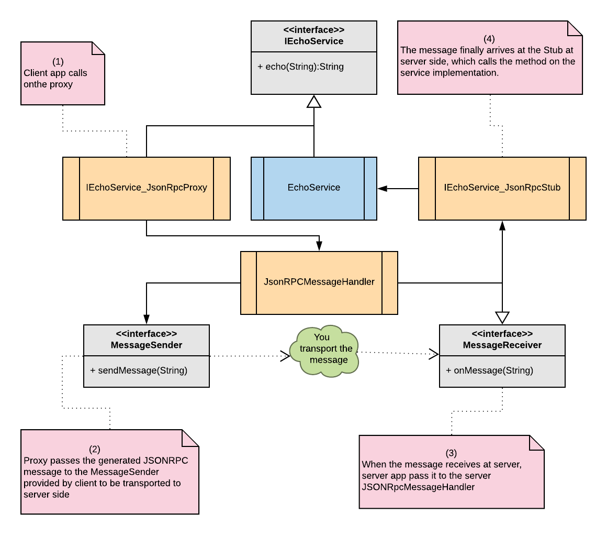

# RPCfy


RPCfy upgrades your normal java interface to be capable of doing RPC (Remote Procedure Call)

## 

Imagine a sample interface IEchoService and its implementation EchoService



RPCfy allows to expose this service as an RPC enabled interface, so that a client can call this interface **echoService.echo("")** from anywhere, like a **remote system**. 


With RPCfy, the above interface gets these additional capability




All you have to do is annotate the interface using **@RPCfy**


```java
@RPCfy
public interface IEchoService {
    ...
}

```

**At the client side**

* Use the auto-generated proxy
* Provide the transport to send/receive message
* Pass the received messages to the JsonRPCMessageHandler

```java
MessageSender<String> clientMessageSender;//You provide the transport

JsonRPCMessageHandler messageHandler = new JsonRPCMessageHandler(clientMessageSender);
IEchoService echoService = new IEchoService_JsonRpcProxy(messageHandler);

//When you receive messages from server, pass it to messageHandler
messageHandler.onMessage(messageFromServer);

```

**At the service side**

* Implement your interface
* Wrap your implementation with the auto generated Stub
* Provide the transport to send/receive message
* Pass the received messages to the JsonRPCMessageHandler

```java
MessageSender<String> serverMessageSender;//You provide the transpor
JsonRPCMessageHandler messageHandler = new JsonRPCMessageHandler(serverMessageSender);

IEchoService yourService = new EchoService(); //Your service implementation
messageHandler.registerStub(new IEchoService_JsonRpcStub(messageHandler, yourService));

//When you receive messages from client, pass it to messageHandler
messageHandler.onMessage(messageFromServer);
```

That's it! 


Getting RPCfy
--------

Gradle dependency

```groovy
dependencies {
    implementation 'com.josesamuel:rpcfy-annotations:1.0.14'
    annotationProcessor 'com.josesamuel:rpcfy:1.0.14'
}
```


License
-------

    Copyright 2019 Joseph Samuel
    
    Licensed under the Apache License, Version 2.0 (the "License");
    you may not use this file except in compliance with the License.
    You may obtain a copy of the License at
    
       http://www.apache.org/licenses/LICENSE-2.0
    
    Unless required by applicable law or agreed to in writing, software
    distributed under the License is distributed on an "AS IS" BASIS,
    WITHOUT WARRANTIES OR CONDITIONS OF ANY KIND, either express or implied.
    See the License for the specific language governing permissions and
    limitations under the License.


